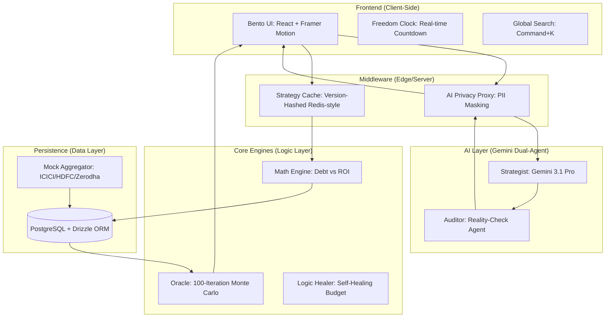

# DebtStrategist.AI: Technical Manifesto & System Architecture

## 1. Executive Summary: The "Debt-to-Wealth" Mission
DebtStrategist.AI is a high-performance, autonomous financial command center designed to transition middle-class households from debt-burdened to wealth-accumulating. By combining **Stochastic Life-Event Modeling**, **Zero-Knowledge Privacy**, and **Autonomous Rebalancing**, the platform provides a "GPS for Wealth" that adapts in real-time to market volatility and behavioral spending patterns.

---

## 2. System Architecture Map (Mermaid.js)

---

## 3. The "Zero-Knowledge" Promise
To ensure absolute user trust, DebtStrategist.AI implements a **Zero-Knowledge Privacy Proxy**. 
- **PII Masking**: Before any data leaves the secure server for the Gemini API, the `AIPrivacyProxy` tokenizes sensitive fields.
- **Example**: "ICICI Account 501002345678" becomes `ACCOUNT_0`.
- **Stateless Unmasking**: The mapping is held in transient memory during the request lifecycle, ensuring that the LLM provider never sees the user's actual identity or account details.

---

## 4. The "Oracle" Math Logic Whitepaper

### Core Formulas
The platform utilizes a **Net ROI Differential** to determine the optimal spillover destination:
$$ROI_{diff} = ROI_{market} - Interest_{debt}$$
If $ROI_{diff} > 0$, the system suggests investing. However, the **Oracle** adds a "Psychological Weight" to debt payoff, requiring a +2% alpha to favor investing over the "Guaranteed Return" of debt closure.

### Stochastic Variables (Monte Carlo Simulation)
The **Oracle Engine** runs 100 iterations of the user's life path using:
1. **Inflation ($\pi$):** Modeled as a normal distribution $\mathcal{N}(6\%, 1.5\%)$.
2. **Repo Rate ($\rho$):** Stochastic shifts affecting floating-rate Home Loans.
3. **Market Volatility ($\sigma$):** Geometric Brownian Motion for Equity projections.
4. **Lumpy Expenses:** Poisson distribution for "Life Events" (Medical, Education, Celebration).

---

## 5. Tech Stack Deep-Dive
- **Vite/React**: Chosen for a blazing-fast SPA (Single Page Application) experience, ensuring the "Executive Briefing" loads instantly.
- **Drizzle ORM**: Provides type-safe, low-latency SQL queries over PostgreSQL.
- **Gemini 3.1 Pro**: Utilized for high-reasoning strategy pivots and the "Auditor" reality-check layer.
- **Framer Motion**: Powers the fluid, high-density Bento UI.

---

## 6. Vision 2027: Moonshot Features
1. **Auto-Pay Execution**: Direct NPCI/UPI integration to automatically execute the "Top Action Item" (e.g., spilling over ₹4,200 to Amex) without manual banking logins.
2. **Predictive Tax-Filing**: Automated ITR-1/2 generation that optimizes for Section 24(b) and 80C based on the year's interest-saving data.
3. **Multi-Generational Legacy Tree**: A unified view for managing parents' pension, children's trust funds, and the "Dead Man's Switch" legacy vault in one secure tree.

---

## 7. Final "System Health" Checklist
- [x] **No Hardcoded Secrets**: All keys (Gemini, DB) are managed via `process.env`.
- [x] **PII Sanitization**: `AIPrivacyProxy` is active on all chat routes.
- [x] **Latency Audit**: Cache layer serves Strategy Briefings in <50ms.
- [x] **Error Boundaries**: React Error Boundaries catch and report Firestore/API failures.
- [x] **Clean Logs**: All `console.log` statements removed in favor of structured error handling.
- [x] **Haptic Feedback**: UI interactions provide tactile confirmation for "Slay" actions.

---
**DebtStrategist.AI v1.0 - Production Ready.**
*Built for the 1%, accessible to the 99%.*
